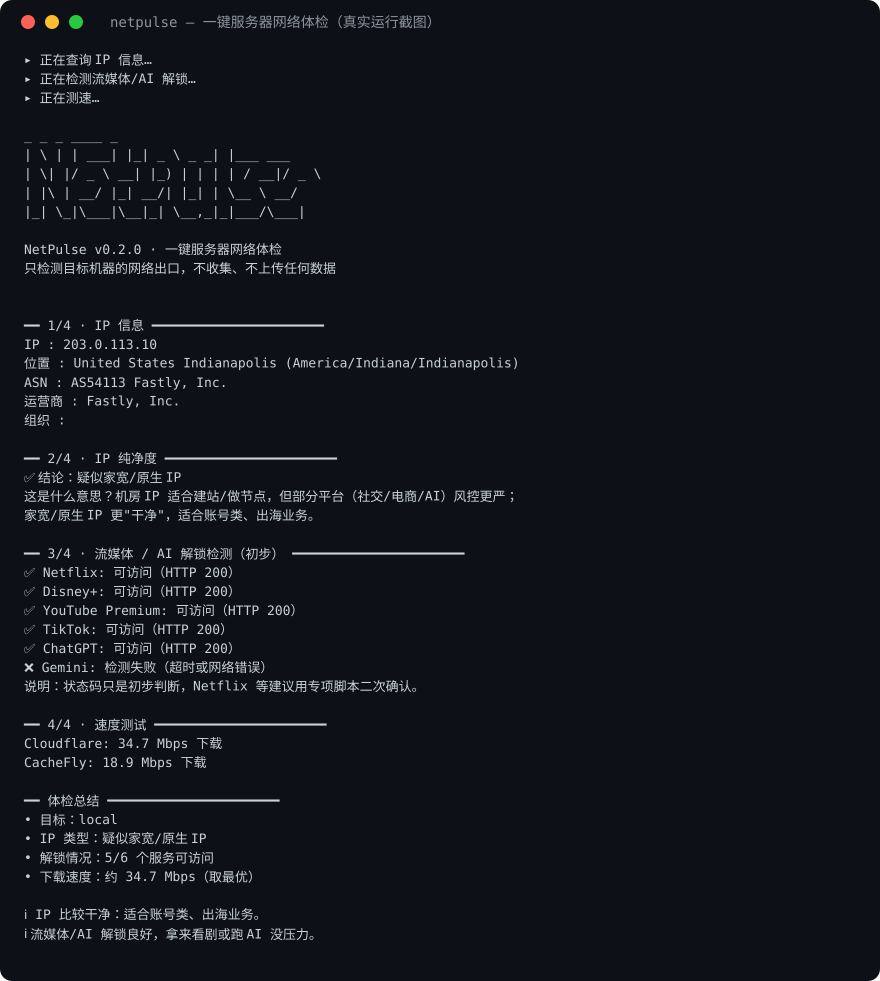

# NetPulse

> **为 AI agent 而生的 VPS 巡检工具**：本地一条命令，批量体检所有机器，结果直接喂给 agent。

[English](README.md) · [中文](README_zh.md)

🌐 官网: https://genuifx.github.io/NetPulse/



## 核心特性：agent 友好 + 批量巡检

别的体检脚本要你一台台 SSH 上去跑。NetPulse 反过来——**你在本地发起，它去机器上执行，结果拿回本地**：

- **本地发起**：`--host user@host` 经 SSH 把脚本送到远端执行，远端缺依赖自动装，你什么都不用管
- **批量巡检**：`--host` 可重复指定，一次体检整个 fleet，自动输出多机对比表
- **JSON 输出**：`--json` 机器可读，直接管道进 `jq` 或喂给 AI agent
- **非交互**：无确认、无彩色（JSON 模式），失败给清晰错误 + 非零退出码，agent 不会卡住

```bash
# 巡检三台机器，JSON 直接给 agent 分析
python3 netpulse.py --host root@vps-a --host root@vps-b --host root@vps-c --json | jq .
```

## 一键运行

```bash
bash <(curl -sL https://raw.githubusercontent.com/Genuifx/NetPulse/main/install.sh)
```

或手动：

```bash
git clone https://github.com/Genuifx/NetPulse.git && cd NetPulse
python3 netpulse.py
```

只依赖 `requests`（缺失时自动安装）。

## 检测项

| 类别 | 内容 |
|---|---|
| IP 信息 | 出口 IP、位置、ASN、运营商 |
| IP 纯净度 | 机房 IP / 家宽 IP / 代理特征 |
| DNS 泄露 | 解析出口属地 vs IP 属地 |
| 解锁检测 | Netflix、Disney+、YouTube Premium、HBO Max、Hulu、Prime Video、TikTok、Spotify、ChatGPT、Claude、Gemini（11 项） |
| 网络质量 | IPv6 出口、到 Cloudflare/Google/百度的 TCP 延迟、下载测速 |

另有 `--share` 生成 Markdown 报告，方便发群里 / 贴工单。

## 给 agent 用的标准姿势

```bash
# 快速判断：IP 纯净度 + AI 服务可达情况
python3 netpulse.py --host root@1.2.3.4 --json \
  | jq '.results[0] | {purity: .checks.purity.value, ai: [.checks.unlock.value | to_entries[] | select(["ChatGPT","Claude","Gemini"] | index(.key)) | {key, status: .value.status}]}'

# 批量巡检整个 fleet
python3 netpulse.py --host root@a --host root@b --host root@c --json \
  | jq '.results[] | {host, status, purity: .checks.purity.value}'
```

JSON 为固定 envelope：`{schema, tool, version, generated_at, results[]}`，
单台多台结构一致。每台结果含 `status`（ok/error）、`error_code`、`checks`（每项
`{status, value, evidence, error, duration_ms}`，status ∈ ok/negative/unknown/error/skipped）
和 `summary`。stdout 在 `--json` 模式下只输出纯 JSON。

退出码：`0` 全部主机正常，`1` 部分主机失败，`2` 全部失败。

其他选项：`--no-speed` 跳过测速（按流量计费时用），`--timeout SEC` 整体时间预算
（默认 120 秒），`--share -o 报告.md` 保存 Markdown 报告。

## FAQ

**解锁检测准吗？**
状态码只是初步判断（200 ≈ 可访问，403/451 ≈ 疑似区域限制）。Netflix 等建议用专项脚本二次确认，我们的定位是快速初筛。

**`--host` 需要什么条件？**
本地有 `ssh` 命令，远端有 `python3`，且配置了 SSH key 免密登录（`BatchMode=yes`，不支持交互输密码）。

**支持跳板机 / 特殊端口吗？**
`--host` 就是普通 SSH，走你自己的 `~/.ssh/config` 即可。

## 免责声明

本工具仅检测**你自己的服务器**的网络状况，不做任何针对他人的扫描或追踪。请勿用于未授权的机器。
